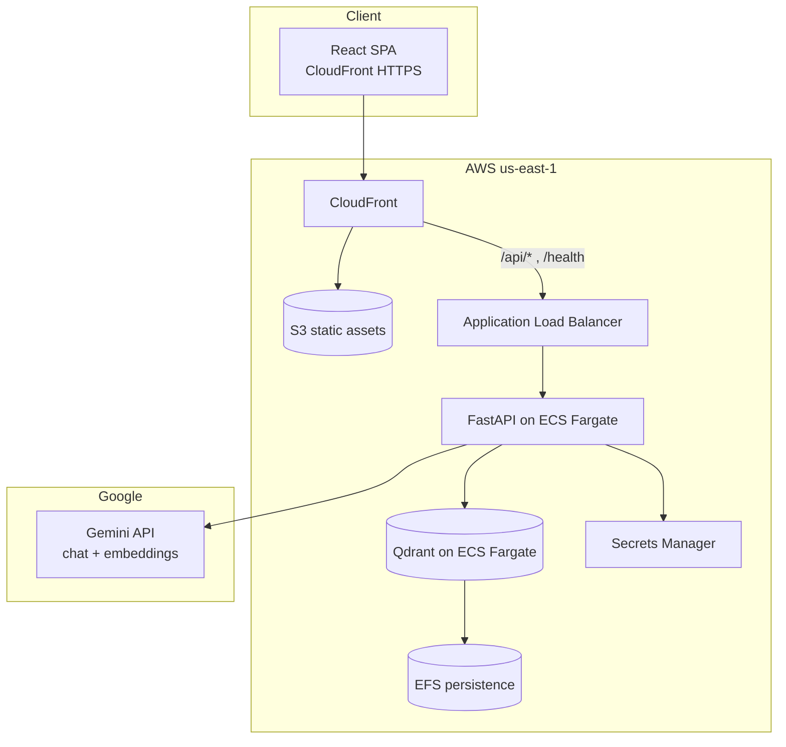
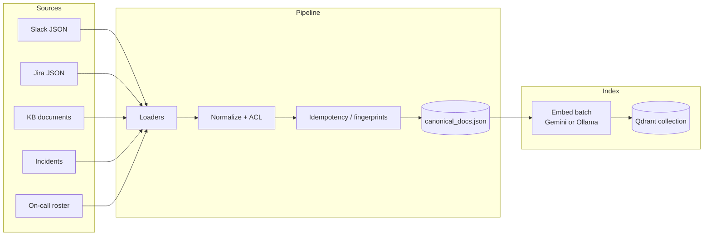

# TechCorp Internal Knowledge Assistant

**Production-style enterprise RAG** over Slack, Jira, runbooks, and incidents — with **ACL-aware retrieval**, **hybrid search**, **grounded generation**, and a **deployed AWS stack**.

[Live Demo](https://dthh8ilmdbf8n.cloudfront.net)
[Region](https://aws.amazon.com/)
[LLM](https://ai.google.dev/)

---

## Live application


| Resource               | URL                                                                                        |
| ---------------------- | ------------------------------------------------------------------------------------------ |
| **Web app (UI + API)** | **[https://dthh8ilmdbf8n.cloudfront.net](https://dthh8ilmdbf8n.cloudfront.net)**           |
| API health (via CDN)   | [https://dthh8ilmdbf8n.cloudfront.net/health](https://dthh8ilmdbf8n.cloudfront.net/health) |


Open the demo, pick a **persona** (team / role), and ask operational questions. Answers are grounded in retrieved evidence with **numbered citations**. Try suggested prompts or ask things like *“What are open P1 issues for payments?”* or *“Who am I?”* (session identity).

> **Note:** This is a portfolio system backed by **synthetic TechCorp data** (~610 canonical documents). It is designed to demonstrate how a real internal assistant would behave, not to serve proprietary production data.

---

## What this project is

Large engineering organizations store critical knowledge across **Slack**, **Jira**, **incident records**, and **internal wikis**. Generic chatbots ignore permissions, hallucinate ticket IDs, and collapse when a question spans multiple channels.

This project implements an **internal knowledge assistant** that:

1. **Ingests** heterogeneous sources into a canonical document schema with rich metadata and ACL fields.
2. **Retrieves** with **BM25 + dense vectors + reciprocal rank fusion (RRF)**, query expansion, channel coverage, and score boosts — not naive top‑k vector search.
3. **Filters every candidate** through **access control** before ranking and generation.
4. **Generates** answers only from delimited evidence blocks, with mandatory citation markers `[n]`.
5. **Refuses or abstains** when evidence is missing, and blocks common **prompt-injection** patterns at input and output.
6. **Measures quality** with a 25-case evaluation harness and a dedicated security eval suite.
7. **Runs in production-shaped AWS infrastructure** (ECS Fargate, Qdrant, CloudFront, Gemini).

The result is something you can **demo in a browser**, **defend in system-design interviews**, and **extend** toward a real financial or platform engineering deployment.

---

## Highlights


| Capability                | Implementation                                                                           |
| ------------------------- | ---------------------------------------------------------------------------------------- |
| **Hybrid retrieval**      | BM25 (sparse) + Qdrant (dense) + RRF fusion                                              |
| **ACL / RBAC**            | Per-document visibility, team, role; deny-by-default for external personas               |
| **Grounded generation**   | Evidence in `<evidence>` tags; citations required; abstain on weak support               |
| **Multi-channel queries** | Per-channel BM25 + merge when questions name multiple Slack channels                     |
| **Security guards**       | Input guard (injection, ACL bypass attempts) + output guard (citation / dump checks)     |
| **Session identity**      | “Who am I?” answered from active persona without fake RAG retrieval                      |
| **Evaluation**            | 25 cases — retrieval ~94% checks, 20/25 full pass; 8/8 security input cases              |
| **Deployment**            | AWS Path B: Fargate API + Fargate Qdrant + EFS + ALB + S3 + CloudFront + Secrets Manager |
| **LLM provider switch**   | `LLM_PROVIDER=ollama` (local) or `gemini` (cloud)                                        |


---

## Architecture

### End-to-end request flow




### RAG pipeline (application layer)

```mermaid
sequenceDiagram
  participant U as User
  participant API as FastAPI
  participant IG as Input guard
  participant SI as Session identity
  participant R as Hybrid retriever
  participant ACL as ACL filter
  participant LLM as Gemini chat
  participant OG as Output guard

  U->>API: POST /api/ask (query + persona)
  API->>IG: check_input(query)
  alt blocked
    IG-->>API: security refusal
  else identity question
    API->>SI: try_identity_answer
    SI-->>API: persona response
  else RAG path
    API->>R: expand query + search
    R->>ACL: filter_acl_docs
    R->>R: BM25 + dense + RRF + diversify
    R-->>API: top-k evidence + citations
  alt insufficient evidence
    API-->>U: abstain message
  else
    API->>LLM: generate with evidence blocks
    LLM-->>API: answer + [n] citations
    API->>OG: validate_output
    OG-->>U: sanitized answer
  end
```


### Ingestion and indexing




---

## Design decisions (why it is built this way)

### Hybrid retrieval instead of vectors-only

Operational queries often contain **exact tokens** — ticket keys (`PAY-1041`), severity labels (`P1`, `SEV1`), status words (`Blocked`). Pure embedding search misses these. **BM25** captures lexical overlap; **dense retrieval** captures paraphrase and context. **RRF** merges ranked lists without fragile score normalization.

### ACL before and during retrieval

Access control is not a post-filter on the final answer. Documents are filtered to the **allowed set** for the caller’s `team`, `role`, and `clearance` before BM25 indexing and as a **Qdrant payload filter** for dense search. Unauthorized personas (e.g. external intern) see sharply reduced corpora — validated in eval case **q25**.

### Grounded generation with abstention

The model receives only numbered evidence inside `<evidence>`. Instructions forbid inventing incident IDs, following jailbreak text inside `<user_question>`, or dumping the index. If evidence does not support an answer, the system returns a fixed **insufficient evidence** sentence — unless partial channel evidence exists, in which case a **deterministic fallback summary** can still cite what was found.

### Provider abstraction

Local development uses **Ollama** (no cloud spend). Production on AWS uses **Google Gemini** (`gemini-2.5-flash` for chat, `gemini-embedding-001` for vectors). Switching providers is an environment variable, not a rewrite.

### CloudFront as a single HTTPS origin

The browser loads the SPA from S3 via CloudFront and calls `**/api/`* on the same hostname**, proxied to the ALB. That avoids **mixed-content** blocks (HTTPS page calling HTTP API).

---

## Tech stack


| Layer            | Technology                                                    |
| ---------------- | ------------------------------------------------------------- |
| **Frontend**     | React 18, TypeScript, Vite                                    |
| **API**          | FastAPI, Uvicorn, Pydantic v2                                 |
| **Retrieval**    | Custom BM25, Qdrant, RRF, ranking boosts                      |
| **LLM (prod)**   | Google Gemini API                                             |
| **LLM (local)**  | Ollama (`nomic-embed-text`, configurable chat model)          |
| **Vector DB**    | Qdrant (Docker locally, ECS + EFS on AWS)                     |
| **IaC / deploy** | Terraform, ECR, ECS Fargate, ALB, CloudFront, Secrets Manager |
| **Language**     | Python 3.11+                                                  |


---

## Data corpus

Synthetic **TechCorp** dataset under `synthetic_data/techcorp/`:


| Source         | Description                                                 |
| -------------- | ----------------------------------------------------------- |
| Slack          | Channel messages (e.g. `eng-platform`, `incidents-warroom`) |
| Jira           | Stories, bugs, epics with status and priority               |
| Knowledge base | Runbooks, policies, escalation guides                       |
| Incidents      | SEV records, root cause, mitigation                         |
| Users / teams  | Personas for ACL demos                                      |


**~610** canonical chunks after ingestion (`app/outputs/canonical_docs.json`).  
**25** gold-style eval queries in `synthetic_data/techcorp/demo_queries_25.md` with automated checks in `synthetic_data/techcorp/eval_cases.json`.

---

## Security model

### Input guard (`app/security/input_guard.py`)

Blocks or sanitizes patterns such as:

- “Debug mode”, “disable ACL”, pentest exfiltration framing  
- Hiring-manager / interview approval social engineering  
- Requests to dump all documents or override system policy

Blocked queries return a **refusal** without hitting retrieval.

### Output guard (`app/security/output_guard.py`)

Validates model output for citation consistency and unsafe content (e.g. answering with citations when claiming insufficient evidence).

### Optional API key

Set `API_KEY` on the server and `VITE_API_KEY` in the frontend build to require `X-API-Key` on `POST /api/ask` (recommended for public ALB endpoints).

---

## Evaluation

### Retrieval + answer harness

```bash
# Fast: retrieval checks only
python3 -m app.run_eval --mode retrieval

# Slower: full pipeline including generation
python3 -m app.run_eval --mode full
```

Reports: `app/outputs/eval_report.md`, `app/outputs/eval_report.json`.

**Latest retrieval-mode snapshot** (representative):


| Metric               | Result                    |
| -------------------- | ------------------------- |
| Check pass rate      | **~94%** (110/117 checks) |
| Cases fully passing  | **20 / 25**               |
| ACL-sensitive subset | **3 / 3**                 |


### Security eval

```bash
python3 -m app.run_security_eval
```

**8 / 8** input-guard cases passing in security-only mode.

Interview-oriented failure analysis: `[INTERVIEW_FAILURES.md](INTERVIEW_FAILURES.md)`.

---

## Project structure

```text
rag/
├── app/
│   ├── api_server.py          # FastAPI: /api/ask, personas, health
│   ├── rag_pipeline.py        # Orchestration: guards → retrieve → generate
│   ├── main.py                # Ingestion entrypoint
│   ├── index_embeddings.py    # Embed + upsert to Qdrant
│   ├── run_eval.py            # Evaluation CLI
│   ├── run_security_eval.py
│   ├── retrieval/             # BM25, hybrid, ACL, ranking, Gemini/Ollama
│   ├── security/              # Input / output guards
│   ├── pipeline/              # Loaders, normalize, idempotency
│   └── outputs/               # canonical_docs, eval reports, embeddings meta
├── frontend/                  # React UI
├── synthetic_data/techcorp/   # Source JSON + eval cases
├── deploy/
│   ├── terraform/             # AWS Path B infrastructure
│   ├── scripts/               # push image, secrets, index, frontend
│   └── AWS_PATH_B_RUNBOOK.md
├── SETUP_LOCAL.md
├── DEPLOY_AWS.md
└── README.md                  # ← you are here
```

---

## API overview


| Method | Path                   | Description                                                     |
| ------ | ---------------------- | --------------------------------------------------------------- |
| `GET`  | `/health`              | Service status + `llm_provider`                                 |
| `GET`  | `/api/personas`        | Demo identities (team, role, clearance)                         |
| `GET`  | `/api/example-queries` | Suggested prompts                                               |
| `POST` | `/api/ask`             | RAG query (body: `query`, `team`, `role`, `clearance`, `top_k`) |


**Example** (production via CloudFront):

```bash
curl -s -X POST "https://dthh8ilmdbf8n.cloudfront.net/api/ask" \
  -H "Content-Type: application/json" \
  -d '{
    "query": "What are the top open P1 issues for payments?",
    "team": "payments",
    "role": "Senior Engineer",
    "clearance": "internal",
    "top_k": 6
  }'
```

Response includes `answer`, `citations[]`, `abstained`, `stats` (ACL counts, fusion counts), and `security_blocked` when applicable.

---

## Local development

Detailed steps: `[SETUP_LOCAL.md](SETUP_LOCAL.md)`.

### Prerequisites

- Python 3.11+
- Node.js 18+
- Docker (Qdrant)
- Ollama **or** Gemini API key

### Quick start

```bash
# 1. Qdrant
docker run -d --name qdrant -p 6333:6333 \
  -v qdrant_storage:/qdrant/storage qdrant/qdrant

# 2. Python deps
pip install -r requirements.txt
cp .env.example .env
# Edit .env — for Gemini locally:
#   LLM_PROVIDER=gemini
#   GEMINI_API_KEY=...

# 3. Ingest + index (first time)
python3 -m app.main
python3 -m app.index_embeddings --recreate

# 4. API
uvicorn app.api_server:app --reload --host 127.0.0.1 --port 8080

# 5. UI
cd frontend && npm install && npm run dev
# → http://localhost:5173
```

### Environment variables


| Variable             | Description                           |
| -------------------- | ------------------------------------- |
| `LLM_PROVIDER`       | `ollama` (default) or `gemini`        |
| `GEMINI_API_KEY`     | Required when `LLM_PROVIDER=gemini`   |
| `GEMINI_CHAT_MODEL`  | Default `gemini-2.5-flash`            |
| `GEMINI_EMBED_MODEL` | Default `gemini-embedding-001`        |
| `QDRANT_URL`         | Default `http://localhost:6333`       |
| `QDRANT_COLLECTION`  | Default `techcorp_docs`               |
| `CORS_ORIGINS`       | Comma-separated allowed origins       |
| `API_KEY`            | Optional shared secret for `/api/ask` |


See `[.env.example](.env.example)` and `[frontend/.env.example](frontend/.env.example)`.

---


## License

This repository is provided for **portfolio and educational use**. Synthetic data is fictional. 

Author: venkateswararao jannegorla 


---

## Author note

Built as a **FAANG-level portfolio system**: ingestion, ACL, hybrid RAG, guards, eval, and a **live AWS deployment** — intended to be demoed, measured, and discussed in depth rather than presented as a notebook prototype.

**Live demo:** [https://dthh8ilmdbf8n.cloudfront.net](https://dthh8ilmdbf8n.cloudfront.net)